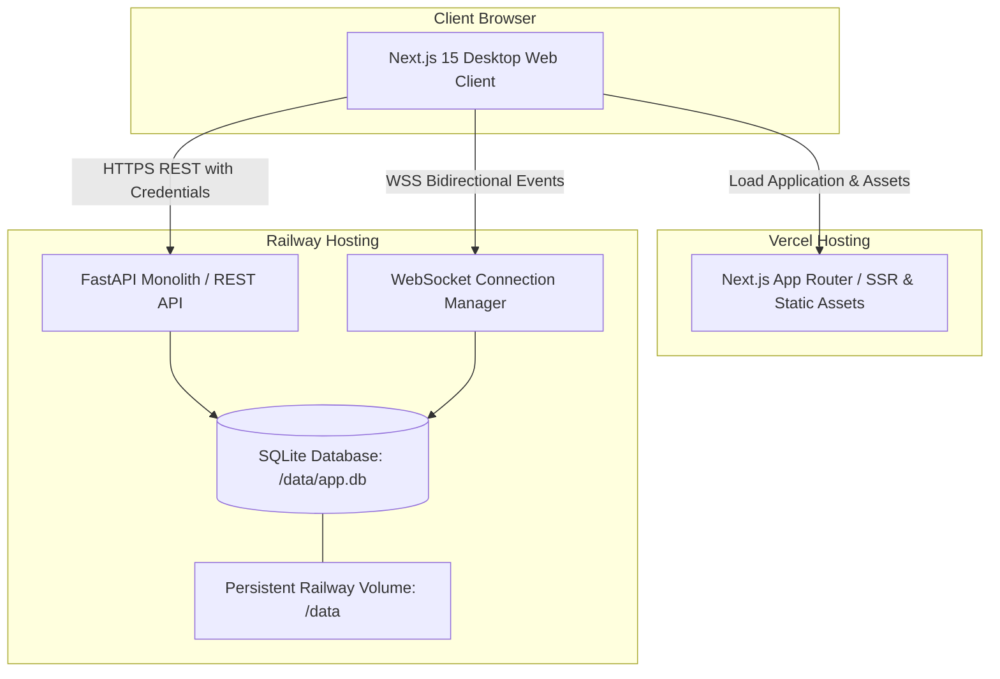

# Secure Messaging Platform (Signal Clone)

Production-quality Signal Desktop web application built with **Next.js 15 (App Router)**, **Python FastAPI**, **SQLite (ACID compliant)**, and **WebSockets**.

---

## Live Demo

- **Frontend (Web Application):** [https://signal-clone-pi.vercel.app](https://signal-clone-pi.vercel.app)
- **Backend API:** [https://signal-clone-production-f521.up.railway.app](https://signal-clone-production-f521.up.railway.app)
- **Health Check Endpoint:** [https://signal-clone-production-f521.up.railway.app/health](https://signal-clone-production-f521.up.railway.app/health)
- **GitHub Repository:** [https://github.com/SlayerBit/signal-clone](https://github.com/SlayerBit/signal-clone)

The backend `/health` endpoint has been verified live and returns:
```json
{"status": "ok"}
```

---

## Deployment Architecture & Topology

The application is deployed across a decoupled frontend/backend production architecture:



### Infrastructure Roles

- **Vercel:** Hosts the Next.js 15 frontend application with App Router, Tailwind CSS, and Zustand client state.
- **Railway:** Hosts the FastAPI monolith running under Uvicorn, serving all REST endpoints and the full-duplex `/ws` WebSocket endpoint on a unified port.
- **Persistent Volume:** A dedicated Railway volume mounted at `/data` stores the production SQLite database (`/data/app.db`), guaranteeing ACID data persistence across restarts and redeploys.
- **WebSockets:** Realtime messaging, typing indicators, delivery/read receipts, and online presence broadcast directly via FastAPI's `ConnectionManager`.

---

## Production Environment Separation

The production environment separates public frontend client configurations from backend service settings:

### Frontend Environment (Vercel)

| Variable | Description | Example / Production Value |
|----------|-------------|----------------------------|
| `NEXT_PUBLIC_API_URL` | Base URL for REST API requests | `https://signal-clone-production-f521.up.railway.app` |
| `NEXT_PUBLIC_WS_URL` | Secure WebSocket URL for realtime sync | `wss://signal-clone-production-f521.up.railway.app/ws` |

### Backend Environment (Railway)

| Variable | Description | Production Configuration |
|----------|-------------|--------------------------|
| `DATABASE_URL` | SQLAlchemy connection string | `sqlite:////data/app.db` (persistent volume) |
| `CORS_ORIGINS` | Allowed origins for credentialed CORS | `https://signal-clone-pi.vercel.app` |
| `COOKIE_SECURE` | Restrict session cookie to HTTPS | `true` |
| `COOKIE_SAMESITE` | Cookie SameSite policy for cross-origin | `none` |
| `SEED_ON_STARTUP` | Auto-seed database if empty on launch | `true` |
| `MOCK_OTP` | Standard mock OTP code for evaluator demos | `123456` |
| `SECRET_KEY` | Cryptographic secret for signing tokens | Set in Railway secret manager (value omitted) |

> **Production Cookie Architecture:** The backend issues an `HttpOnly` session cookie with `Secure=True` and `SameSite=None`, permitting authenticated cross-origin requests from the Vercel domain to the Railway API (`credentials: "include"`).

---

## Demo Credentials & Authentication

The database is pre-seeded with multiple demo accounts. Evaluators can sign in immediately using either password login or mock OTP:

| User | Display Name | Identifier (Username or Phone) | Password / Mock OTP | Role / Seeded State |
|------|--------------|--------------------------------|---------------------|---------------------|
| **Om** (Primary Demo) | Om Sharma | `om` or `+919842946727` | `123456` | Primary admin account with active 1:1 and group chats |
| **Rahul** (Secondary) | Rahul Verma | `rahul` or `+919842946728` | `123456` | Active chat partner for dual-browser live testing |
| **Priya** | Priya Patel | `priya` | `123456` | Contact with existing message history |
| **Arjun** | Arjun Mehta | `arjun` | `123456` | Member in Scaler AI Labs group |
| **Neha** | Neha Gupta | `neha` | `123456` | Contact with message history |
| **Kavya** | Kavya Iyer | `kavya` | `123456` | Contact |

### Supported Authentication Methods

1. **Password Login:** Enter username/phone and password `123456` at `/login`.
2. **OTP Login:** Enter username/phone, leave password blank or request OTP, and verify with mock OTP **`123456`**.
3. **New User Registration:** Visit `/register` to create a new profile with phone/username, verify using OTP **`123456`**, and choose display name and avatar color.

---

## Scope & Implemented Enhancements

### Mandatory Capabilities

1. **Profile Avatar Selection System:**
   - Curated vector illustration presets (`avatar_id`: Shield, Fox, Lotus, Bolt, Spark, Wave, Wings, Cat, Owl, Bot, Orbit, Peaks) paired with a background color palette selector.
   - Available during account onboarding (`/register`) and editable anytime under `Settings > Profile`.
   - Real-time preview and instant store synchronization across the navigation rail, conversation rows, active chat headers, and group member lists.
   - Stored directly in the `users` database table with graceful initial monogram fallback.

2. **Notification & Toast Feedback System:**
   - Lightweight, accessible application-level notification system (`Toast.tsx`) mounted globally.
   - Clear visual feedback for key actions: authentication errors/success, contact additions, duplicate contact warnings, group member additions and removals, messaging send failures, profile updates, and clipboard copy actions.
   - Screen-reader accessible (`role="status"`, `aria-live="polite"`), auto-dismissing, theme-adaptive, and positioned unobtrusively in the bottom-right viewport.

### Selected Bonus Features

1. **Reply-to / Quoted Messages:**
   - Spatially anchored `Reply` button on message hover.
   - Real-time quote preview banner in composer with dismiss button.
   - Embedded quote cards inside message bubbles displaying sender name and referenced text snippet.
   - Smooth click-to-scroll navigation that automatically scrolls the viewport to the referenced message and triggers a temporary highlight animation.

2. **Emoji Reactions:**
   - Spatially anchored `Smile` reaction trigger adjacent to message bubbles.
   - Instant reaction picker popover (`👍`, `❤️`, `😂`, `😮`, `😢`, `🔥`) with anti-clipping viewport bounds.
   - Aggregated interactive reaction chips displayed directly beneath message bubbles.
   - Click existing chips to increment or toggle your reaction with live WebSocket synchronization.

3. **Signal Light & Dark Theme Support:**
   - Centralized CSS custom property design system supporting authentic **Signal Dark** (`#121214`) and **Signal Light** (`#ffffff` / `#f5f5f8`) palettes.
   - Instant toggle available via the App Menu and `Settings > Appearance`.
   - Dynamic chat bubble accent color selector (Signal Blue, Emerald, Violet, Crimson, Amber, Graphite).
   - Zero-FOUC pre-hydration script ensuring persistent theme state from `localStorage` without layout flash.

### Functional UX Enhancements

- **In-Chat Message Search:** Functional search header in the active chat view with instant substring matching, match counter ("X of Y"), previous/next navigation buttons, `Enter`/`Shift+Enter` keyboard shortcuts, `<mark>` term highlighting, and auto-scroll to matches.
- **Unified Popover Regions:** Reaction picker and more-actions menus utilize transit grace timers and coordinate boundary calculations to prevent accidental dismissal during mouse movement.

### Scoped Product Surfaces & Placeholders

- **Linked Devices:** Dedicated settings page at `Settings > Linked Devices` displaying active desktop session status ("Connected") and an informational placeholder explaining multi-device cryptographic QR pairing for future updates. Intentionally UI-only with no dummy devices or synthetic pairing state.
- **Voice & Video Calls:** Header phone/video icons open authentic Signal Desktop dialogs detailing desktop demo scope and camera/microphone pairing requirements.
- **Stories Surface:** Left rail Stories icon opens a Signal Stories interface showing "My Story" and contact status cards.
- **Settings & Privacy:** Comprehensive Signal Desktop preference categories (Profile, Appearance, Chats, Calls, Notifications, Privacy, Linked Devices, Data Usage, Backups) with realistic interactive toggles.

### Intentionally Excluded Scope

In accordance with project boundaries, file attachments, disappearing messages, real Signal E2EE cryptography, and native mobile builds were kept out of scope to focus on desktop web polish and reliability.

---

## Seeded Data & Workflows to Test

- **Direct Chats:** Om ↔ Rahul, Om ↔ Priya, Om ↔ Neha.
- **Group Chat:** **Scaler AI Labs** (Om & Rahul admins; Priya, Arjun, Neha members) with multi-user conversation history, replies, and reactions.
- **Message Hover Toolbar:** Hover over any message bubble to reveal the floating pill toolbar (`Smile`, `Reply`, `More`) positioned directly adjacent to the bubble.
- **Emoji Reactions:** Click `Smile` or click any reaction chip beneath a bubble to add or toggle reactions.
- **Quoted Replies:** Click `Reply` on any message to populate the composer quote bar; send a response and click the quoted snippet in the bubble to jump to the original message.
- **In-Chat Search:** Click the Search icon in the chat header, type a search phrase (e.g. `test` or `message`), and navigate matches with Enter or the chevron buttons.
- **Theme Switcher:** Toggle between Signal Dark and Signal Light in `Settings > Appearance` or via the hamburger menu in the navigation rail.

---

## Multi-User Realtime Testing (Local)

1. Open **Browser A** (normal window): Sign in as `om` with password `123456`.
2. Open **Browser B** (incognito/private window): Sign in as `rahul` with password `123456`.
3. In both windows, open the **Om ↔ Rahul** conversation.
4. **Typing Indicators:** Start typing in Browser A; Browser B immediately shows `Om is typing…`.
5. **Realtime Messages:** Send a message from Browser A; Browser B instantly renders the incoming message and marks it as delivered/read.
6. **Reactions & Replies:** Add an emoji reaction or send a quoted reply in one browser; the update broadcasts instantaneously to both windows.

---

## Running Locally

### Prerequisites

- Node.js 18+ and npm
- Python 3.11+
- Virtualenv (`python3 -m venv`)

### 1. Backend Setup

```bash
cd backend
python3 -m venv .venv
source .venv/bin/activate
pip install -r requirements.txt
cp ../.env.example .env   # Optional; default settings work out of the box
mkdir -p data
PYTHONPATH=. python seed/run.py
uvicorn main:app --reload --port 8000
```

The backend API will start at `http://localhost:8000`. You can verify it by opening `http://localhost:8000/health`.

### 2. Frontend Setup

In a new terminal window:

```bash
cd frontend
npm install
echo "NEXT_PUBLIC_API_URL=http://localhost:8000" > .env.local
echo "NEXT_PUBLIC_WS_URL=ws://localhost:8000/ws" >> .env.local
npm run dev
```

Open [http://localhost:3000](http://localhost:3000) in your browser to access the application.

---

## Automated Testing

### Backend Unit & Integration Tests

Run the full test suite (11 passing tests) using the backend virtual environment:

```bash
cd backend
source .venv/bin/activate
PYTHONPATH=. pytest tests/ -k "not visual_qa"
```

### Browser Automation & Visual QA Suite

Run the Playwright visual regression and live dual-browser test:

```bash
cd backend
source .venv/bin/activate
python tests/visual_qa.py
```

This automated suite captures full-screen screenshots across all major views in both themes, tests message hover actions, reaction pickers, quoted replies, in-chat search, dialogs, and executes a live 2-user simultaneous WebSocket communication session.

---

## Deployment & Verification Summary

| Component | Target Platform | URL / Endpoint | Verification Status |
|-----------|-----------------|----------------|---------------------|
| Frontend Web Client | Vercel | [https://signal-clone-pi.vercel.app](https://signal-clone-pi.vercel.app) | **Verified** (HTTP/2 307 redirect to `/login`) |
| Backend REST API | Railway | [https://signal-clone-production-f521.up.railway.app](https://signal-clone-production-f521.up.railway.app) | **Verified** |
| Health Check | Railway | [https://signal-clone-production-f521.up.railway.app/health](https://signal-clone-production-f521.up.railway.app/health) | **Verified** (Returns `{"status":"ok"}`) |
| Persistent Storage | Railway Volume | Mounted at `/data` (`/data/app.db`) | Configured |
| Automated Test Suite | Local Environment | Pytest & Playwright | **Verified** (11/11 tests pass) |
| Live Production Realtime & Cross-Origin Auth | Vercel ↔ Railway | WSS + SameSite=None Cookies | Configured (Not claimed as verified in post-deployment without telemetry) |

