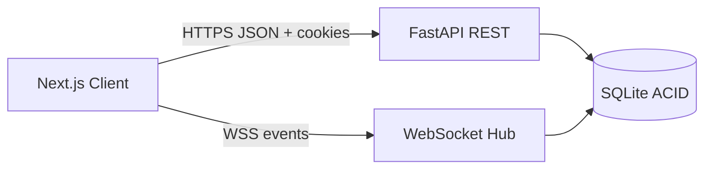
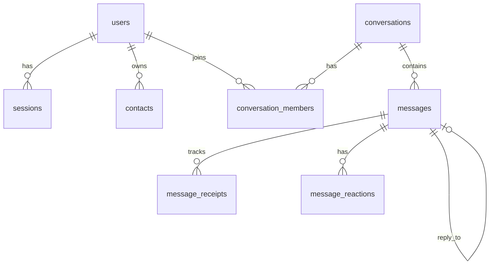

# Architecture — Signal Clone

## System overview



**Decision:** Monolith FastAPI process serves REST + WebSocket on one port (Railway / Docker friendly).  
**Reason:** Assignment scope; minimal ops overhead with full bi-directional communication.  
**Alternatives:** Separate WS service, Redis pub/sub — rejected as unnecessary complexity for single-node SQLite deployment.

---

## Frontend architecture

```
frontend/
  app/
    (app)/
      calls/page.tsx               # Calls page surface
      chats/page.tsx               # Chat overview
      chats/[id]/page.tsx          # Active thread with ChatPane
      settings/[[...section]]/     # Catch-all settings subsections
      stories/page.tsx             # Stories surface
    login/page.tsx                 # Signal login
    register/page.tsx              # Multi-step registration
    globals.css                    # CSS Design Tokens (Dark & Light)
    layout.tsx                     # ThemeProvider & inline theme script
  components/
    layout/
      MessengerShell.tsx           # Nav rail + main pane split
      NavRail.tsx                  # Signal navigation rail with user menu
    providers/
      ThemeProvider.tsx            # Theme initialization & local storage sync
    ui/
      Avatar.tsx                   # User avatar with initial & color badge
  features/
    auth/                          # LoginForm & RegisterForm
    conversations/                 # ChatsSidebar, ConversationList, NewChatView
    messaging/                     # ChatPane, MessageBubble, MessageStatus
    settings/                      # SettingsView (Appearance, Profile, etc.)
  store/
    app-store.ts                   # Zustand store (state, theme, active thread)
  hooks/
    use-realtime.ts                # WebSocket event synchronization
```

### Key UI Subsystems

1. **Theme System:**
   - Centralized CSS variables in `globals.css` with `:root` / `[data-theme="dark"]` and `[data-theme="light"]`.
   - Dynamic accent color customization `--bubble-out` saved in `localStorage`.
   - Pre-hydration script in `layout.tsx` eliminates flash of unstyled content (FOUC).

2. **Spatially Anchored Message Interactions:**
   - Actions toolbar (`Smile`, `Reply`, `More`) is anchored directly adjacent to the message bubble on hover.
   - For outgoing messages, anchored immediately to the left. For incoming messages, anchored immediately to the right.
   - Reaction picker displays directly above the bubble with smooth animation.
   - Aggregated reaction chips render directly beneath the message bubble with interactive user toggling.

3. **In-Chat Message Search:**
   - Independent of sidebar conversation search.
   - Real-time substring matching with navigation buttons (`Prev` / `Next`) and counter.
   - `<mark>` highlighting in message bubbles and smooth auto-scroll to matching messages.

4. **Quoted Replies:**
   - Reply composer preview with accent border and cancel button.
   - Embedded quote card inside message bubbles with sender name and truncated text.
   - Click-to-scroll navigation jumping to the referenced message with temporary highlight animation.

---

## Backend architecture

```
backend/
  app/
    api/          # Route endpoints (auth, conversations, messages, contacts)
    auth/         # Cookie session dependency, password hashing, OTP verification
    core/         # Config, security tokens, CORS
    database/     # SQLAlchemy engine, session maker
    models/       # ORM entities (User, Conversation, Message, Reaction, Receipt)
    repositories/ # Efficient DB query abstractions
    services/     # Business logic (MessageService, AuthService, ConversationService)
    websocket/    # ConnectionManager & event routers
  seed/           # Deterministic database seeder
  tests/          # Pytest unit/integration + Playwright visual QA
  main.py         # Application entry point
```

Layering: **Routes → Services → Repositories → Models**.

---

## Database schema



- **ACID Transactions:** SQLite with WAL mode enabled.
- **Message Lifecycle:** Default status `sent` transitioning to `delivered` upon peer connection, and `read` upon thread viewing.
- **Reactions & Replies:** Stored as relational entities linked to parent messages with foreign key constraints.
